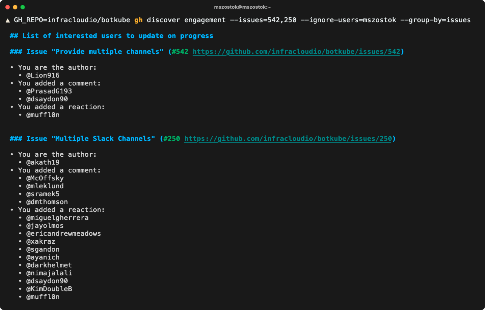
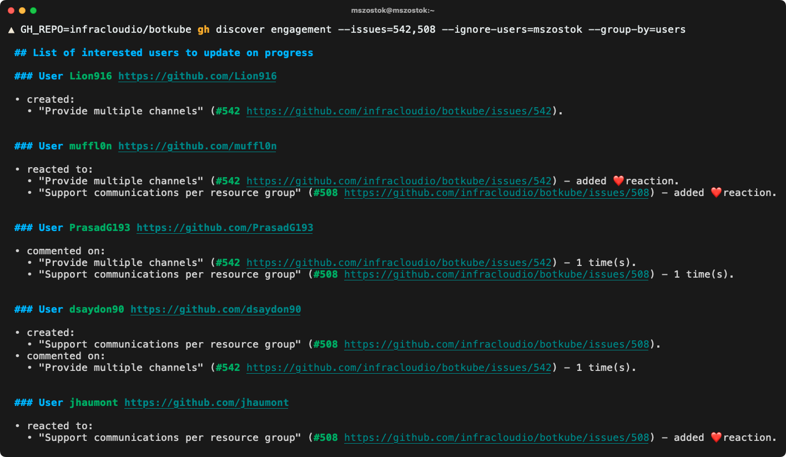

## gh-discover

`gh extension install mszostok/gh-discover`

## Usage

### Discover user engagement

After installation, you can use the `gh discover engagement` command to collect all users, that were engaged in a given list of issue. By engagement, we mean:
- being an issuer author
- adding issue reaction
- adding comment under issue

#### Order by issues

```bash
GH_REPO=infracloudio/botkube \
gh discover engagement \
--issues=508,542 \
--ignore-users=mszostok \
--group-by=issues \
--cache-ttl 20m
```



> **Note**
> To print a raw Markdown format, add the `--raw` flag.

### Order by users

```bash
GH_REPO=infracloudio/botkube \
gh discover engagement \
--issues=508,542 \
--ignore-users=mszostok \
--group-by=users \
--cache-ttl 20m
```



> **Note**
> To print a raw Markdown format, add the `--raw` flag.


## TODO

- [ ] Add option to print the dates of activity (when commented/added reaction etc.)
- [ ] Add an option to print additional user activity in a given repository. Similar to [Search by a user that's involved in an issue or pull request](https://docs.github.com/en/search-github/searching-on-github/searching-issues-and-pull-requests#search-by-a-user-thats-involved-in-an-issue-or-pull-request)
- [ ] Move functionality to `gimme`.
